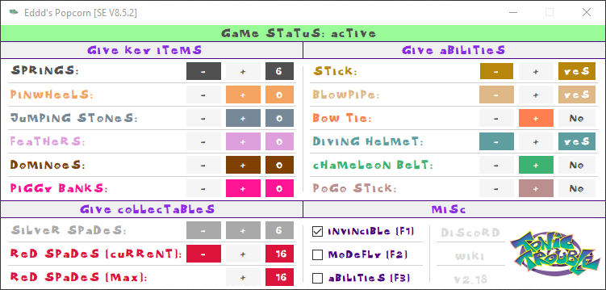
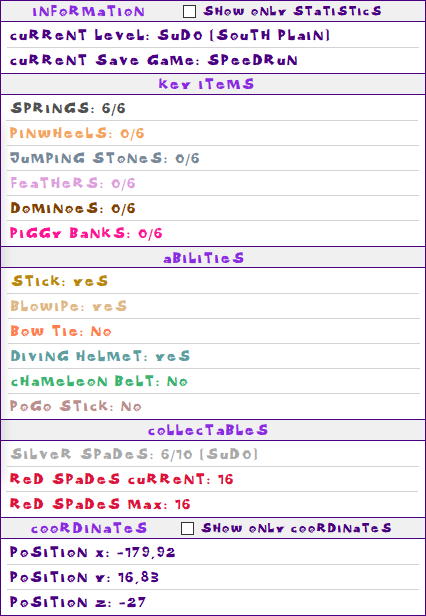

## Screenshots

# Description - [Latest Release](https://github.com/alweg/Eddd-s-Popcorn/releases)
A Trainer for **Tonic Trouble Special Edition (V8.5.2)**

# Features
* Hotkeys for: 
  * Invincibility
  * "modefly" cheat
  * Unlock abilities
  
* Monitor information for:
  * Current position (X, Y, Z)
  * Key Items
  * Current & Max Silver Spades
  * Current & Max Red Spades
  * *more*..
  
* Increase & Decrease count for all key items
* Unlock single abilities

## Notes
* This trainer uses a *custom font*. Download [here](https://drive.google.com/file/d/1Fn6dzkT3LFvqgwM6Hh9GWrzJHfuUWk-X)

## Libraries used
* [Memory.dll](https://github.com/erfg12/memory.dll)
* [Costura](https://github.com/Fody/Costura)

## Other
* You can find more useful tools for **Tonic Trouble** on my [Google Site](https://sites.google.com/view/tonictrouble)

## Releases
https://github.com/alweg/Eddd-s-Popcorn/releases
